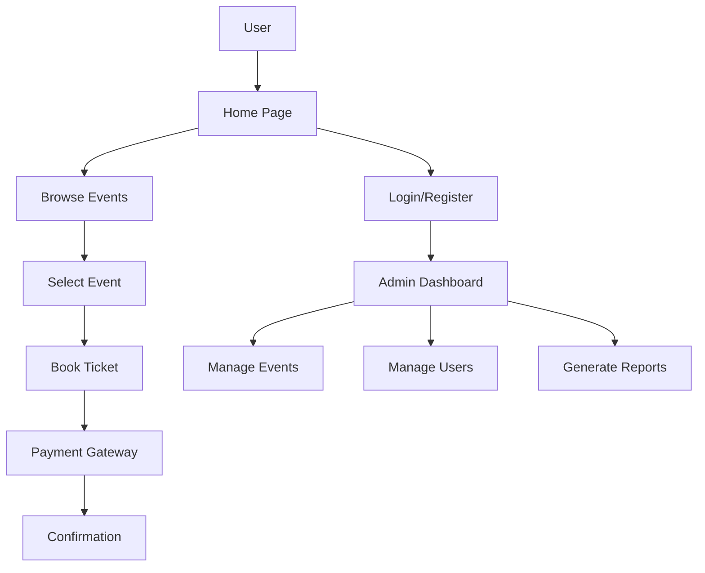

# 🎉 Event Management System  

<div align="center"> 
  
  

### Modern Event Planning & Management Platform  


</div>

---

## ✨ Overview

The **Event Management System** is a responsive web application designed to simplify event planning, booking, scheduling, and attendee management.

Whether it's:

- 🎂 Birthday Parties
- 💍 Weddings
- 🏢 Corporate Events
- 🎓 College Festivals
- 🎤 Concerts
- 🎯 Conferences

The platform provides a seamless experience for both organizers and attendees.

---

# 🚀 Live Preview

<p align="center">

</p>

---

# 🎨 UI Preview

## Home Page

<p align="center">

</p>

## Events Section

<p align="center">

</p>

## Booking Portal

<p align="center">

</p>

## Dashboard

<p align="center">

</p>

---

# ⚡ Features

<div align="center">

| Feature | Description |
|----------|------------|
| 🎫 Event Booking | Quick online reservations |
| 📅 Scheduling | Event timeline management |
| 👥 User Management | Manage attendees |
| 💳 Payments | Secure booking process |
| 📧 Notifications | Email alerts & updates |
| 📱 Responsive Design | Mobile-friendly UI |
| 📊 Dashboard | Event analytics |
| 🔍 Search & Filter | Easy event discovery |

</div>

---

# 🏗 System Architecture



---

# 📂 Project Structure

```bash
Event-Management-System/
│
├── index.html
├── login.html
├── register.html
├── booking.html
│
├── css/
│   ├── style.css
│   └── animations.css
│
├── js/
│   ├── app.js
│   ├── booking.js
│   └── dashboard.js
│
├── assets/
│   ├── images/
│   ├── icons/
│   └── demo.gif
│
└── screenshots/
```

---

# 🛠 Technologies Used

<div align="center">

| Frontend | Framework |
|-----------|------------|
| HTML5 | Structure |
| CSS3 | Styling |
| Bootstrap 5 | Responsive Design |
| JavaScript | Functionality |
| Font Awesome | Icons |
| AOS Library | Scroll Animations |

</div>

---

# 🎬 Animations Used

### AOS (Animate On Scroll)

```html
<link
rel="stylesheet"
href="https://unpkg.com/aos@next/dist/aos.css"
/>

<script src="https://unpkg.com/aos@next/dist/aos.js"></script>

<script>
AOS.init();
</script>
```

Example:

```html
<div data-aos="fade-up">
    Event Card
</div>
```

---

# 📸 Responsive Design

<p align="center">


</p>

---

# 🔥 Key Modules

### 👤 User Module

- Registration
- Login
- Profile Management
- Event Booking

### 🎯 Event Module

- Create Events
- Update Events
- Delete Events
- Event Categories

### 🛡 Admin Module

- Manage Users
- Manage Bookings
- Analytics Dashboard
- Reports Generation

---

# 🚀 Installation

```bash
# Clone repository

git clone https://github.com/yourusername/event-management-system.git

# Open project

cd event-management-system

# Run

Open index.html in browser
```

---

# 🌟 Future Enhancements

- AI Event Recommendations
- QR Ticket Verification
- Online Payments
- SMS Notifications
- Real-time Chat Support
- Calendar Synchronization

---

# 📈 Performance

```text
⚡ Fast Loading
📱 Mobile Responsive
🔒 Secure Authentication
🎨 Modern UI/UX
🚀 Bootstrap Optimized
```

---

# 👨‍💻 Developer

**Gurman Singh(Owner) - Garry's Developers' Team PVT.LTD**

GitHub: https://github.com/yourusername

LinkedIn: https://linkedin.com/in/yourprofile

---

<div align="center">

## ⭐ If you like this project, give it a star ⭐


Made with ❤️ using HTML, Bootstrap & JavaScript

</div>
